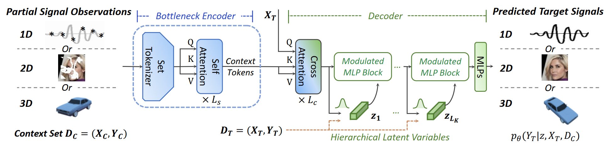

# Versatile-NP

This repository contains the official implementation for the following paper:

[**Versatile Neural Processes for Learning Implicit Neural Representations**](https://arxiv.org/abs/2301.08883), ICLR 2023

## Reproducing 3D Experiments 

The code for 3D experiments follows the logistics of [Trans-INR](https://github.com/yinboc/trans-inr).

### Environment
- Python 3
- Pytorch 1.7.1
- pyyaml numpy tqdm imageio TensorboardX einops

### Data

`mkdir data` and put different dataset folders in it.

- **View synthesis**: download from [google drive](https://drive.google.com/drive/folders/1lRfg-Ov1dd3ldke9Gv9dyzGGTxiFOhIs) (provided by [learnit](https://www.matthewtancik.com/learnit)) and put them in a folder named `learnit_shapenet`, unzip the category folders and rename them as `chairs`, `cars`, `lamps` correspondingly.

### Training

`cd exp3D`  
`CUDA_VISIBLE_DEVICES=[GPU] python run_trainer.py --cfg [CONFIG] --load-root [DATADIR]` 

Configs are in `cfgs/`. Four 3090Ti or four 32GB V100 GPUs are suggested for training.

### Evaluation

For view synthesis, run in a single GPU with configs in `cfgs/nvs_eval`. 

### Checkpoint models

The pretrained checkpoint models can be found in [Google Drive](https://drive.google.com/drive/folders/16_ZrgYLH2oiV0uC6OBwnI3op-24nS0RK?usp=share_link).

|           | Cars  | Lamps | Chairs |
|  :----    | :---- | :---- | :----  |
| PSNR (dB) | 24.21 | 24.10 | 19.54  |

Since the code is reorganized with unified training settings, the performances of lamps and chairs are slightly better than our initial submission in openreview, and the performance of cars is slightly lower than our initial submission. By adjusting the annealing strategy of beta coefficient, the performance of cars could be further improved. 

## Reproducing 1D Experiments

The code for 1D toy examples can be found in the [supplementary material of our Openreview submission](https://openreview.net/forum?id=2nLeOOfAjK).